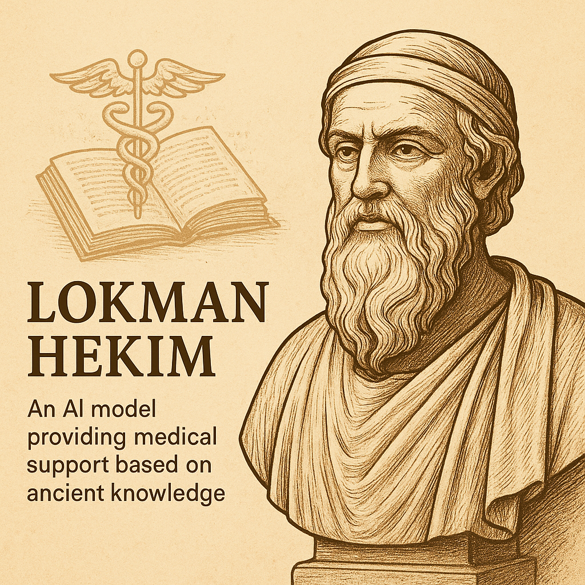

# Lokman Hekim LLM

LangChain ve Ollama kullanan, reçete CSV dosyalarını işleyip analiz eden Node.js tabanlı sohbet uygulaması.


## Kurulum

1. Repo klonla ve dizine gir:

```bash
git clone https://github.com/Burak1320demiroz/LLM_lokmanhekim.git
cd LLM_lokmanhekim
````

2. Paketleri yükle:

```bash
npm install
```

3. Ollama kur ve modeli indir başka bir terminalden:

```bash
ollama pull llama3.1
ollama serve
```

4. Uygulamayı başlat:

```bash
npm run dev
```


## Kullanım

* Tarayıcıda `http://localhost:3000` aç.
* Sohbete mesaj gönder.
* Reçete CSV URL'si göndererek analiz alabilirsin.

---